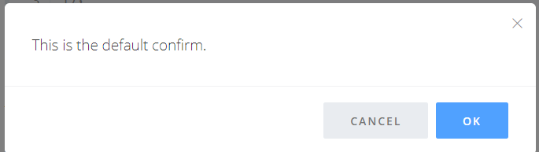
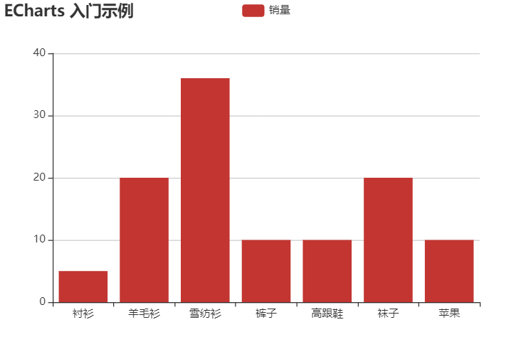

大事件


## lazyload.js

 https://appelsiini.net/projects/lazyload/ 

作用: 图片懒加载

原理:只有处在可见区域的图片，才会去加载图片。

示例：

```
<script src="https://cdn.jsdelivr.net/npm/lazyload@2.0.0-rc.2/lazyload.js"></script>


<script>
lazyload();
</script>
```

## bootboxjs

 http://bootboxjs.com/getting-started.html 

 Bootbox.js旨在通过使用Bootstrap模态框更容易 。



它是基于bootstrap和jquery的一个弹出层插件。

 http://bootboxjs.com/examples.html#bb-confirm 


```javascript
引入jquery,bootstrap.js,bootstrap.css
<link rel="stylesheet" type="text/css" href="css/bootstrap.min.css">

<script src="./js/jquery-1.12.4.min.js"></script>
<script src="./js/bootstrap.min.js"></script>
<script src='https://cdnjs.cloudflare.com/ajax/libs/bootbox.js/5.3.3/bootbox.min.js'></script>


 bootbox.alert("不能为空");

// bootbox.confirm("你确定要删除吗？", function(result){ 
//     console.log('你的选择' + result); 
// });
```


## echart.js

[官网]( [https://www.echartsjs.com/zh/tutorial.html#5%20%E5%88%86%E9%92%9F%E4%B8%8A%E6%89%8B%20ECharts](https://www.echartsjs.com/zh/tutorial.html#5 分钟上手 ECharts) )



```javascript
<!DOCTYPE html>
<html lang="en">
<head>
    <meta charset="UTF-8">
    <meta name="viewport" content="width=device-width, initial-scale=1.0">
    <meta http-equiv="X-UA-Compatible" content="ie=edge">
    <title>Document</title>
</head>
<body>
    <!-- 为 ECharts 准备一个具备大小（宽高）的 DOM -->
    <div id="main" style="width: 600px;height:400px;"></div>

    <script src="./js/echarts.min.js"></script>
    <script type="text/javascript">
        // 基于准备好的dom，初始化echarts实例
        var myChart = echarts.init(document.getElementById('main'));

        // 指定图表的配置项和数据
        var option = {
            title: {
                text: 'ECharts 入门示例'
            },
            tooltip: {},
            legend: {
                data:['销量']
            },
            xAxis: {
                data: ["衬衫","羊毛衫","雪纺衫","裤子","高跟鞋","袜子","苹果"]
            },
            yAxis: {},
            series: [{
                name: '销量',
                type: 'bar',
                data: [5, 20, 36, 10, 10, 20,10]
            }]
        };

        // 使用刚指定的配置项和数据显示图表。
        myChart.setOption(option);
    </script>
</body>
</html>
```


### ajax求数据再画图

先取回数据，画图一定在在回调函数中去画。

```
1. 初始化，得到echart对象
// var myChart = echarts.init(document.getElementById('main'));
2. 设置options (画图所需的配置项)
   // 取回数据 去设置options中需要更改的数据。
3. 画图
// 使用刚指定的配置项和数据显示图表。
   myChart.setOption(option);

```


